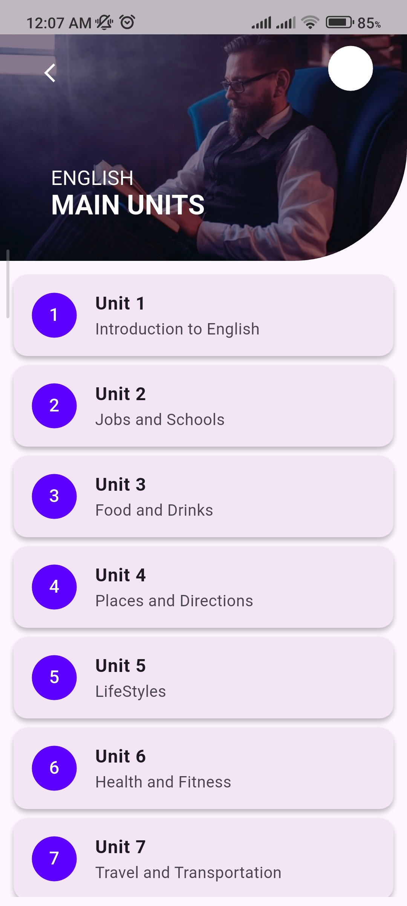
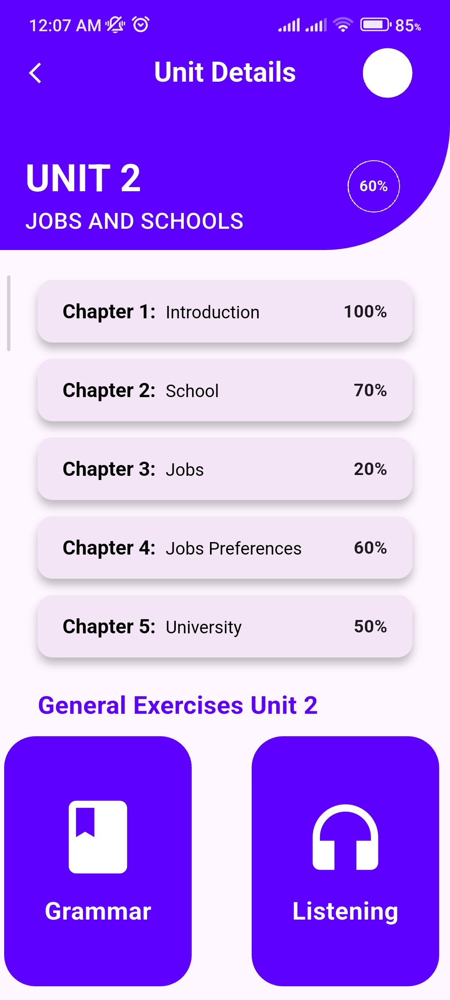

# 📱 Unit Login UI App (Flutter)

A clean and modern Flutter-based UI application designed to demonstrate multi-screen navigation and structured UI design. This project focuses on building a smooth user interface flow without backend or functional logic.

---

## 🎯 Project Overview

This application contains a simple UI flow:

1. Home Screen  
2. Units Screen  
3. Unit Details Screen  

The main focus of this project is UI design, layout structuring, and screen navigation visuals.

---

## 🚀 Features

- Clean and modern UI design
- Multi-screen navigation flow
- Home screen layout
- Units listing screen UI
- Unit details screen UI
- Responsive design for different screen sizes
- Beginner-friendly Flutter UI structure

---

## 📸 Screenshots

### 🏠 Home Screen


### 📚 Units Screen


### 📖 Unit Details Screen


---

## 🛠️ Tech Stack

- Flutter
- Dart
- Material Design

---

## ⚙️ Project Type

This is a **UI-only project**:
- No backend integration
- No database
- No authentication
- No functional API calls

👉 Purpose: Practice UI design and screen layout in Flutter

---

## 🧠 Learning Outcomes

This project helped in understanding:

- Flutter widget tree structure
- Multi-screen navigation concepts
- UI composition techniques
- Layout building using Flutter widgets
- Design consistency across screens

---

## 📂 Project Structure


lib/
├── main.dart
├── screens/
│ ├── home_screen.dart
│ ├── units_screen.dart
│ └── unit_details_screen.dart


---

## 📱 How to Run

Clone the repository:

```bash
git clone https://github.com/your-username/flutter-unit-ui-app.git

Navigate to project folder:
cd flutter-unit-ui-app

Install dependencies:
flutter pub get

Run the app:
flutter run
```

## 🎯 Future Improvements

Add backend integration
Add authentication system
Connect units with real data
Improve animations and transitions
Add state management (Provider / Bloc)
## 👨‍💻 Author

Umar
Flutter Developer | BSCS Student
